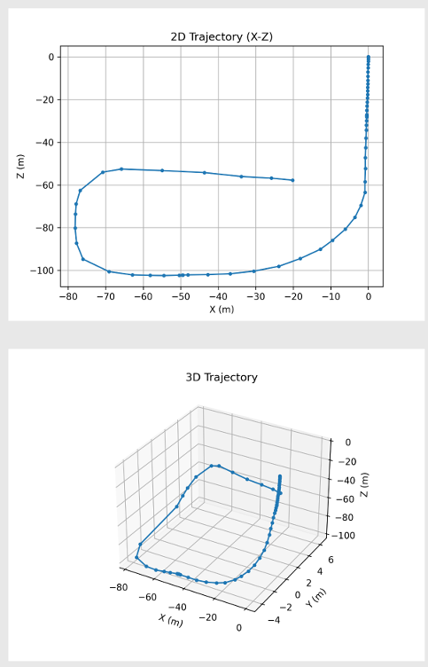
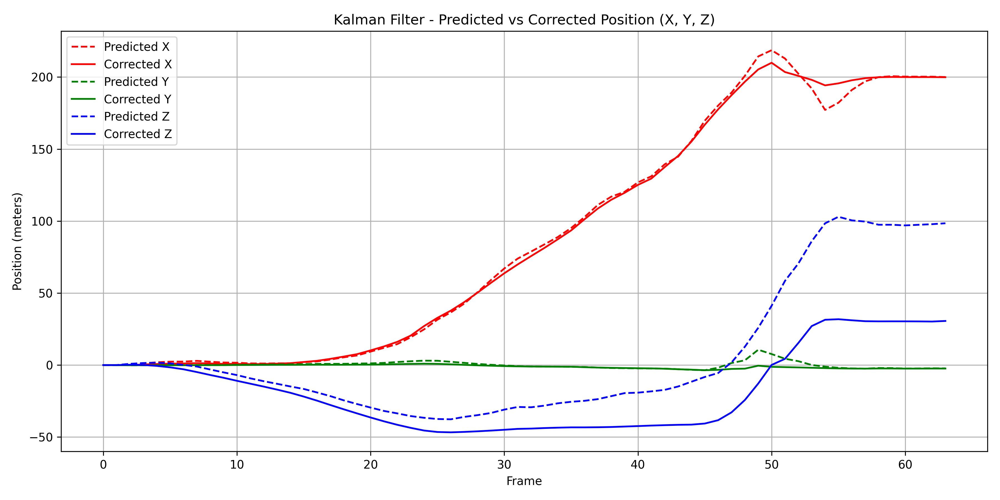

# Stereo Visual SLAM in CARLA Simulation

This project implements a full stereo visual SLAM (Simultaneous Localization and Mapping) pipeline in the CARLA autonomous driving simulator. It includes stereo depth estimation, visual odometry using PnP, basic loop closure detection, global point cloud map generation, and pose fusion using a simple 9D Kalman Filter.

---

##  Key Features

- Stereo RGB camera setup using CARLA
- Feature detection (SIFT/ORB) and stereo depth computation via SGBM
- 3D reconstruction from disparity maps
- Pose estimation using solvePnP with RANSAC
- Basic loop closure detection
- Real-time trajectory and global map visualization
- 9D Kalman Filter combining visual pose and IMU data

---

##  Results

##  Demo Video
[SLAM map generated](https://www.youtube.com/watch?v=0km4ypER8EA)

### 2D and 3D Trajectory 


### Kalman Filter Graph
 


---

##  Requirements

- Python 3.8+
- CARLA Simulator (Tested on 0.9.15)
- `numpy`, `opencv-python`, `open3d`, `matplotlib`, `argparse`

```bash
pip install -r requirements.txt
```

---

##  How It Works

### Sensors Setup

- Two RGB cameras placed at ±baseline distance for stereo input
- IMU sensor for accelerometer and gyroscope readings

### Pipeline

1. **Stereo Depth Estimation**  
   Disparity map is computed using OpenCV's SGBM, converted to depth using known focal length and baseline.

2. **Visual Odometry**  
   Features are matched across frames and 3D points from stereo are used in `solvePnPRansac` to estimate motion.

3. **Kalman Filter Fusion**  
   A minimal 9D Kalman Filter fuses IMU acceleration & gyro with vision-based position & orientation.

4. **Loop Closure Detection**  
   Descriptors from keyframes are compared to detect loop closures (naively, no optimization backend yet).

5. **Mapping & Visualization**  
   Global 3D point cloud is built and saved. Trajectory is plotted in 2D & 3D.

---

##  Usage

Run this from your terminal after launching CARLA simulator:

```bash
python stereo_vslam_pipelinev2.py --duration 60 --weather clear
```

Optional flags:

- `--no-display` : Run without OpenCV display windows
- `--baseline`   : Stereo camera baseline in meters (default: 0.54)
- `--fov`        : Field of View of the cameras (default: 90)
- `--weather`    : Options include `clear`, `cloudy`, `rain`, `sunset`

---

##  Output Files

| File | Description |
|------|-------------|
| `trajectory_2d.png` | X-Z plane trajectory |
| `trajectory_3d.png` | 3D pose plot |
| `slam_map.ply` | Colored 3D point cloud map |
| `predicted_positions.npy` | Kalman predicted positions |
| `corrected_positions.npy` | Kalman corrected positions |

---

## Future Improvements

- Loop closure backend optimization (e.g., pose graph)
- Bundle Adjustment
- Robust outlier rejection
- Semantic segmentation overlay

---

